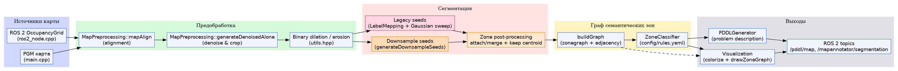
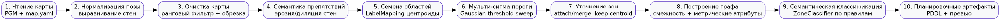
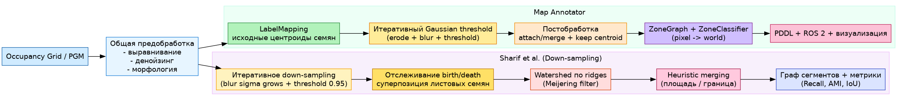

# Map Annotator

Инструмент для семантической сегментации двумерных карт помещений, построения
графа зон и генерации описаний задач в формате PDDL для экспериментов с
планированием траекторий роботов. Проект можно запускать как из консоли, так и
в виде ROS 2 ноды, потребляющей `nav_msgs/OccupancyGrid`.

## Возможности

- нормализация карты, удаление шума и корректировка занятых/свободных областей;
- поиск семян зон по центроидам и мульти-сигмовая сегментация свободного
  пространства;
- построение графа смежности зон с привязкой к мировым координатам и правилами
  семантической классификации (`config/rules.yaml`);
- генерация PDDL-задач и цветовых превью с отображением графа;
- ROS 2 нода, публикующая результат в `/pddl/map` и `/mapannotator/segmentation`.

## Архитектура



1. Источники карты: из файла `PGM` (+ `map.yaml`) или из ROS 2.
2. Предобработка (`preparing/`, `utils.hpp`): выравнивание стен, денойзинг,
   морфология.
3. Сегментация (`segmentation/`, `map_processing.cpp`):
   - **Downsample seeds** (`generateDownsampleSeeds`) — новый точный режим с
     трекингом рождения/смерти семян;
   - **Legacy seeds** (`LabelMapping` + Gaussian sweep) — быстрый режим;
   в обоих случаях выполняются общие шаги прилипания пикселей и
   `keepCentroidComponent`.
4. Построение графа (`mapgraph/`): расчет смежности, преобразование пикселей в
   мировые координаты, классификация правилом (`ZoneClassifier`).
5. Выходы (`pddl/`, `visualization.hpp`, `ros2_node.cpp`): PDDL, визуализация и
   публикация в ROS 2.

## Последовательность семантических действий



1. Чтение карты и метаданных (`map.yaml` → `MapInfo`).
2. Выравнивание и детектирование доминирующих стен (`MapPreprocessing::mapAlign`).
3. Удаление шума + кадрирование (`generateDenoisedAlone`).
4. Семантическая обработка препятствий (диляция/эрозия `erodeBinary`).
5a. Генерация семян через down-sampling + отслеживание birth/death.
5b. (Альтернатива) Семена из `LabelMapping` + Gaussian sweep.
6. Постобработка: сохранение компоненты с центроидом, прилипания пикселей,
   слияние «одиноких» областей.
7. Построение графа смежности и перевод координат в метрическое пространство.
8. Семантическая классификация правилом (`ZoneClassifier`, `config/rules.yaml`).
9. Генерация PDDL и визуализаций (`PDDLGenerator`, `colorizeSegmentation`).

## Точный режим сегментации

В ветке `feature/downsample-segmentation` реализован «точный» режим,
использующий многократное даун-сэмплирование свободного пространства и трекинг
семян, вдохновлённый работой Sharif et al. (arXiv:2303.13798). Новые семена
генерируются функцией `generateDownsampleSeeds`, после чего выполняются
стандартные шаги прилипания пикселей и очистки (см. `map_processing.cpp`). Диаграмма
ниже показывает, как ветки Map Annotator и статьи делят общие блоки пайплайна:



Ключевые параметры точного режима:

- `SegmentationParams::useDownsampleSeeds` — переключение между точным и
  «наследуемым» быстрым алгоритмом;
- `DownsampleSeedsConfig` (`sigmaStart`, `sigmaStep`, `maxIter`,
  `threshold`, `backgroundKernel`) — управляют фильтрацией и
  детекцией рождения/смерти семян;
- ROS-параметры `segmentation.use_downsample_seeds`,
  `segmentation.downsample_sigma_start`, `segmentation.background_kernel`
  позволяют менять режим без пересборки.

При включённом режиме итоговые зоны используют «листья» иерархии семян,
что заметно уменьшает пере- и недо-сегментацию длинных коридоров.

Файлы `docs/architecture.dot` и `docs/semantic_actions.dot` можно отредактировать
и пересобрать изображения командой:

```bash
dot -Tpng docs/<diagram>.dot -o docs/<diagram>.png
```

## Dependencies

The application depends on [OpenCV](https://opencv.org/) and
[yaml-cpp](https://github.com/jbeder/yaml-cpp). On Debian/Ubuntu systems they can
be installed with:

```bash
sudo apt-get install libopencv-dev libyaml-cpp-dev
```

## Building

```bash
mkdir build
cd build
cmake ..
make
```

If CMake cannot find OpenCV or yaml-cpp make sure the development packages are
installed and that the libraries are discoverable via `CMAKE_PREFIX_PATH` or the
`OpenCV_DIR`/`YAML_CPP_DIR` variables.

## Usage

```
./mapannotator <map.pgm> [config.yaml]
```

The program expects a grayscale map image in `.pgm` format and an optional YAML
configuration. It outputs diagnostic information, generates a PDDL problem file
and creates visual previews of the computed zones.

## Configuration

- `map.yaml` — стандартный файл от SLAM/`map_server`, откуда читаются origin,
  `resolution` и угол поворота. Эти данные сохраняются в `MapInfo` и
  используются при переводе пикселей в мировые координаты.
- `config/rules.yaml` — иерархия типов зон и набор приоритетных правил
  классификатора. Доступные признаки: площадь `A`, аспект `AR`, окружность `C`,
  количество соседей `N`, статистики ширины проходов `w_min`, `w_avg` и др.
  Именно этот файл определяет семантику, попадающую в PDDL и визуализацию.
- `ros2_node.cpp` экспортирует параметры, которые можно передавать через
  `ros2 run ... --ros-args -p <name>:=<value>`:
  - `map_topic`, `pddl_topic`, `segmentation_topic`;
  - `denoise.crop_padding`, `denoise.rank_binary_threshold`;
  - `dilate.kernel_size`, `dilate.iterations`;
  - `alignment.enable`;
  - `segmentation.max_iter`, `segmentation.sigma_step`,
    `segmentation.threshold` — управляют как наследуемым,
    так и точным режимом;
  - `segmentation.use_downsample_seeds`, `segmentation.downsample_sigma_start`,
    `segmentation.background_kernel` — параметры нового генератора семян;
  - `start_zone`, `goal_zone` (имена в генерируемой PDDL).

## Repository structure

- `segmentation/` – image processing and segmentation routines
- `mapgraph/` – zone graph data structures and visualisation helpers
- `pddl/` – utilities for generating PDDL from the graph
- `config/` – example classification rules
- `docs/architecture_comparison.png` – сравнение пайплайнов статьи и Map Annotator
- `docs/architecture.png` – обзорная архитектура пайплайна
- `docs/semantic_actions.png` – последовательность семантических шагов
- `default.yml` – минимальный конфиг по умолчанию для CLI
- `scripts/batch_segment.py` – офлайн скрипт для прогонки `mapannotator` на
  всех картах из `test_maps` (см. раздел ниже)

### Пакетный запуск без ROS 2

Сборка ROS 2 не обязательна для тестов. После компиляции CLI (`build/mapannotator`)
можно прогнать все `.pgm` (включая вложенные подпапки) из каталога `test_maps`:

```bash
python scripts/batch_segment.py \
    --binary build/mapannotator \
    --maps-dir test_maps \
    --output-dir batch_results \
    --clean-artifacts
```

Для каждой карты скрипт сохраняет stdout/stderr, извлечённый PDDL, копии
`graph.dot` и `graph_preview.png`, а также summary YAML. Структура подпапок
в `test_maps` сохраняется в `batch_results`. Если рядом с `.pgm` лежит
`map.yaml`/`map.yml` или файл с тем же именем и расширением `.yaml`/`.yml`,
он будет подставлен автоматически; при отсутствии такого файла скрипт подставит
`default.yml`. Для кастомного конфигурационного файла можно
передать `--config path/to/custom.yml`.

## License

This project is distributed under the terms of the MIT license. See
[LICENSE](LICENSE) for details.

## ROS 2 Integration

When ROS 2 and the required message packages are available the project can be
built with an additional node that consumes a `nav_msgs/OccupancyGrid` and
publishes the generated PDDL.

The node subscribes to `/map` by default and publishes to `/pddl/map`. Example
build and run steps:

```bash
mkdir build && cd build
cmake ..
make mapannotator_ros2
ros2 run mapannotator mapannotator_ros2
```
